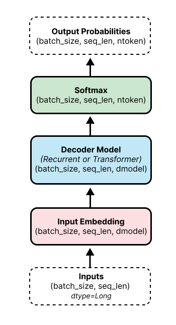
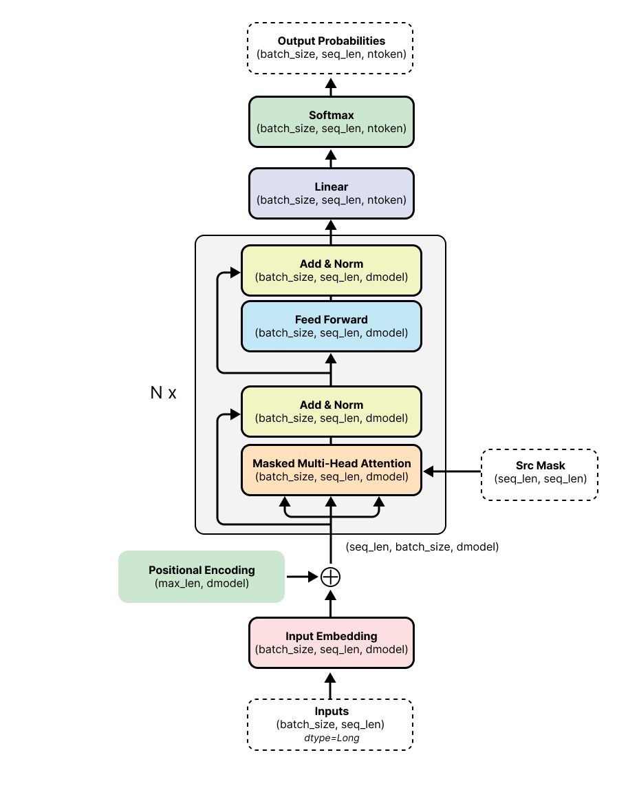
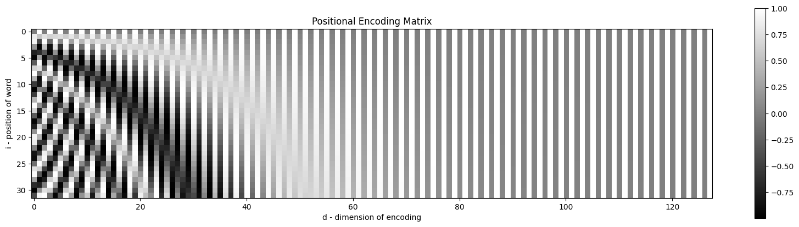
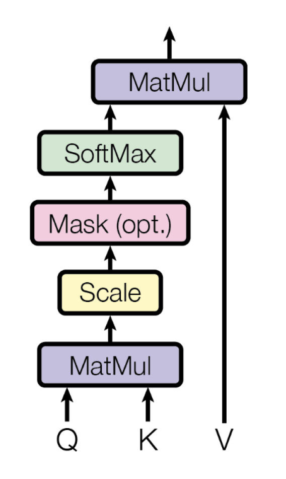

# Language Models
In this repo, I built two types of language models: recurrent and transformer. I have a pipeline for training and doing hparam sweeps using W&B. Below, I give a brief intro into language models and transformer architecture, then outline the key components in the implementation. 

**Note:** I am actively working on and improving this repo.

 

## 1. Language Model Overview
A language model estimates the probability distribution over a sequence of tokens, e.g. words. Given a previous set of tokens $(u_{1}, \dots, u_{i-1})$, a LM can predict the next token $u_i$. 

$$
\begin{equation}
P(u_{1}, \dots, u_{m}) = \prod_i^m P(u_i |u_{1}, \dots, u_{i-1})
\end{equation}
$$

 In practice, a langauge model takes in a sequence of tokens, feeds them through an embedding layer, decoder model and softmax function to output the probabilities over the vocabulary (vocab size = `ntoken`). The decoder model is typically either a recurrent model (RNN, LSTM, GRU, etc.) or transformer. Recurrent models will process each word in sequence, while a transformer can process the sequence in parallel using a mask.

## 2. Transformer Language Model
The Transformer architecture used here is similar to that employed in (Liu et al., 2018) and the original GPT (Radford et al., 2018). For a language model, we do not need the encoder-decoder architecture needed in neural machine translation (NMT) as in Vaswani et al. (2017). Instead, we can just use a decoder network. This decoder block is similar to the encoder block in Vaswani et al. (2017), as it only consists of two sublayers: Self-Attention and Feed-Forward. One key difference between the encoder block in Vaswani et al. (2017) and the decoder here is that we use Masked Self-Attention rather than unmasked. 

  

Below, I'll dive into the three important components of the transformer architecture: positional encoding, scaled dot-product attention, and multi-head attention. Here are some of the key parameters we'll be using in this doc.
- $d_\text{model}$ : dimension of the embedding size and the layers within the model
- $d_\text{vocab}$ : size of vocabulary - listed as `ntoken` in diagrams

### 2.1 Positional Encoding
We use positional encodings to inject information about relative or absolute position into the model. It is the size $d_\text{model}$ and can simply be added onto the word embedding. Vaswani et al. (2017) described two ways to create Positional Encoding: learned or sinusoidal. 

**Sinusoidal Positional Encoding** \
For this method, we precompute a PE matrix and store it in the buffer. $PE \in \mathbb{R}^{\text{maxseqlen} \times d_{\text {model }}}$
  - Each row represents the encoding for a specific word at position $i$
  - Each column represents a different sinusoidal function at a different wavelength - every other column is alternating between sine and cosine - which is why there is banding in the upper dimensions because the wavelength is much larger.

 

### 2.2 Scaled Dot-Product Attention
Before looking at Multi-Head Attention, it's important to understand Scaled Dot-Product Attention. 

**Queries, Keys and Values** \
So, what are Queries $Q$, Keys $K$, and Values $V$? In concept, you can think of Scaled Dot-Product Attention as a differentiable lookup table, where the lookup table has keys and associated values (similar to a dictionary if you aren't familiar with lookup tables). Because we may not have access to the direct Keys in the lookup table, we use Queries and calculate the similarity/alignment score between the Queries and the Keys. In self-attention, the Query, Key and Value are all the same values.

$$
\begin{equation}
\text{Attention}(Q,K,V) = \text{softmax}(\frac{Q K^T}{\sqrt{d_k}})V
\end{equation}
$$

**Operations**
  1. **MatMul** - $QK^T$ - Calculate the alignment score to see how much the two word embeddings match - calculate between the each query $Q$ and key $K$
  2. **Scale** -$\frac{1}{\sqrt{d_k}}$- Divide by $\sqrt{d_k}$ for more stable gradients, used for regularization and improves performance for larger models - $d_k$ is the dimension of the keys
  3. **Mask**  - (optional) mask out future positions
  4. **Softmax** - Apply softmax function to obtain the weights for the values $V$
  5. **MatMul** - Apply weights to values $V$

 

### 2.3 Multi-Head Attention
Rather than performing a single attention function with the scaled dot-product attention function with $d_\text{model}$ - dimensional keys, values and queries →  linearly project the QKV $h$ times with different learned linear projections
$$
\begin{equation}
\begin{split}
\text{MultiHead}(Q,K,V) & = \text{Concat}(\text{head}_1, \dots,\text{head}_h)W^O\\
\text{where} \; \text{head}_i  & = \text{Attention}(QW_i^Q,KW_i^K, VW_i^V) 
\end{split}
\end{equation}
$$

**Operations**
1. **Linear** - Linearly project QKV each with its own set of weights
   - This is where we project into different subspaces and learn alignment for different representations
2. **Scaled Dot-Procduct Attention** - For each projected version, perform the scaled dot-product attention function in parallel
3. **Concat** - Concatenate all of the scaled dot-product attention heads $(\text{head}_1, \dots,\text{head}_h)$
4. **Linear** - Project the concatenated heads back to the size of $d_\text{model}$ to produce the final values

 

**Why Multi-head attention?**
 - Can jointly attend to different representation subspaces at different positions
 - Vaswani et al. (2017) used $h=8$ parallel attention layers
     - $d_k = d_v = d_{\text{model}} / h = 64$
 - Due to reduced dimension of each head, total computation cost is similar to that of a single-head attention with full dimensionality

 

---

## 3. Implementation

### 3.1 Dataset
I am using WikiText2 from `torchtext`.  Below is an exeprt from the dataset. As you can see, it is already preprocessed having the rare words replaced with the `<unk>` token. The vocabulary has a total of 28,782 tokens it. 

<code>

 = Valkyria Chronicles III = 

 

 Senjō no Valkyria 3 : <unk> Chronicles ( Japanese : 戦場のヴァルキュリア3 , lit . Valkyria of the Battlefield 3 ) , commonly referred to as Valkyria Chronicles III outside Japan , is a tactical role @-@ playing video game developed by Sega and Media.Vision for the PlayStation Portable . Released in January 2011 in Japan , it is the third game in the Valkyria series . <unk> the same fusion of tactical and real @-@ time gameplay as its predecessors , the story runs parallel to the first game and follows the " Nameless " , a penal military unit serving the nation of Gallia during the Second Europan War who perform secret black operations and are pitted against the Imperial unit " <unk> Raven " . 
</code>

### 3.2 Positional Encoding 
- Sinusoidal Positional Encoding - same as Vaswani et al. (2017)
  - In PyTorch implementation, we take advantage of the log-exp trick to make the math a bit easier. 

### 3.3 Learning Rate Schedulers
- StepLr
- Inverse Square Root with Warm-up
- Cosine with Warm-up

---
### Transformer Architecture References

#### Attention is All You Need
- **Architecture**
  - Encoder-Decoder Transformer model for Machine Translation
  - At beginning of both encoder and decoder models is an embedding layer for each relevant vocabulary and a sinusoidal positional embedding layer. 
    - Embedding multiply by $\sqrt{d_{\text{model}}}$
  - (512 dimensional states with 8 attention heads)
  - **Encoder**
    - Stack of $N = 6$ identical layers consisting of two sublayers: self-attention and feed-forward network. 
    - Around each sublayer is a residual connection.
    - Following the residual connection is layer normalization.
  - **Decoder**
    - Stack of $N = 6$ identical layers consisting of three sublayers: masked self-attention, encoder-decoder attention, and feed-forward network. 
    - Around each sublayer is a residual connection.
    - Following the residual connection is layer normalization.
  - **Position-wise Feed-Forward Networks**
    - Two linear layers with a ReLU activation in between
      $$\text{FFN}(x) = \text{max}(0, xW_1 + b_1)W_2 + b_2$$
    - Input and output dims: $d_{\text{model}}=512$
    - Inner-layer dims: $d_{ff}=2048$
  - **Optimization**
    - Adam optimizer with $\beta_1 = 0.9, \beta_2=0.98$ and $\epsilon=10^{-9}$
    - Used linear warmup with inverse square root decay afterwards
  - Used **bytepair encoding (BPE)** vocabulary with target vocabulary of ~37000 tokens

#### GPT 
- **Architecture**
  - 12-layer decoder-only transformer with masked self-attention heads (768 dimensional states and 12 attention heads)
  - Position-wise feed forward networks - used 3072 dimensional inner states
- **Optimization**
  - Adam optimizer with max lr of 2.5e-4
  - **lr scheduler**: increased linearly from zero over the first 2000 updates, annealing to 0 using a cosine schedule
  - 100 epochs using minibatches of 64 randomly sampled, contiguous sequences of 512 tokens
- **Weight initialization of $N(0, 0.02)$** is sufficient b/c Layer norm is used throughout
- Used **bytepair encoding (BPE)** vocabulary with 40,000 merges
- Residual, embedding and attention **dropouts with rate of 0.1** for regularization
- Modified version of L2 regularization with $w=0.01$ on all non-bias or gain weights
- GELU activation function
- Used learned position embeddings instead of sinusoidal

---
### Sources
- Liu, P. J., Saleh, M., Pot, E., Goodrich, B., Sepassi, R., Kaiser, L., & Shazeer, N. (2018). Generating Wikipedia by Summarizing Long Sequences. https://doi.org/10.48550/arXiv.1801.10198
- Radford, A., Narasimhan, K., Salimans, T., & Sutskever, I. (2018). Improving Language Understanding by Generative Pre-Training.
- Vaswani, A., Shazeer, N., Parmar, N., Uszkoreit, J., Jones, L., Gomez, A. N., Kaiser, L., & Polosukhin, I. (2017). Attention Is All You Need. http://arxiv.org/abs/1706.03762

